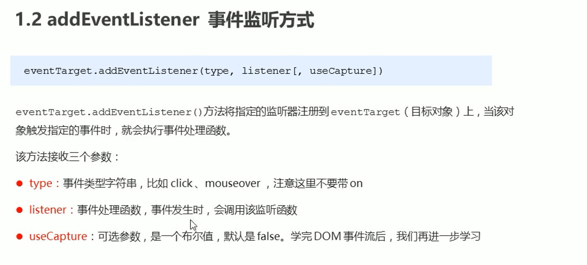
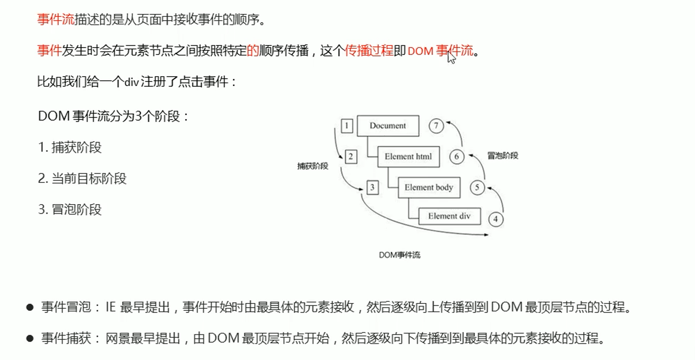
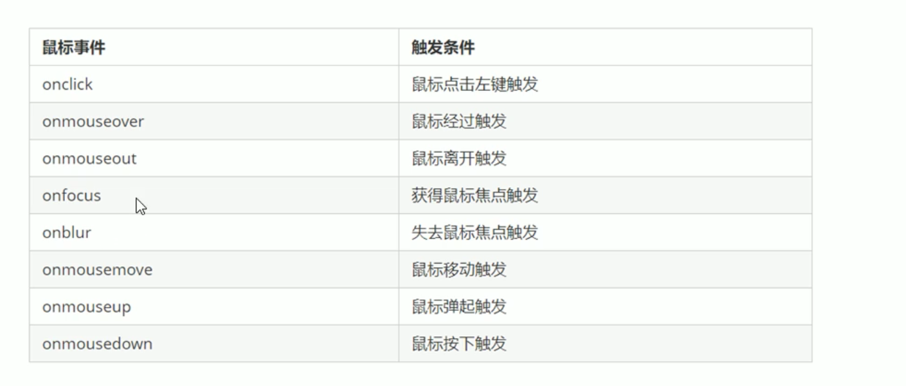
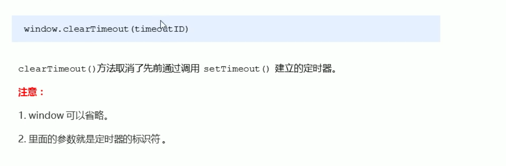

> 关于js中有些时候调用函数不加括号，有些时候需要加上括号的原因解释
>
> **使用js之前，要理解，everything is object ，任何东西都是对象**，所以function也是对象
>
> function my(){}; 其实就是生成了一个名字叫做my的对象，这个对象是个function对象，同时也是一个函数，它等同于var my=function(){};
>
> 他们的区别是作用域不同，前者是window级别是globar的，一些浏览器认为是window对象下面的my属性。后者是当前作用域下的my对象
>
> 一般在my后面加上() 认为是执行这个function对象中的内容，并且能够得到返回值。
>
> 
>
> 由此得知
>
> var my1=my;       //其实就是吧my对象赋值给my1 my1是个function对象。
> var my1=my();   //先执行my对象映射的函数，然后把执行结果(return关键字返回，如果没有返回值，那么my1就是undefined
>
> 说白了就是：函数也是一个对象，无论是
>
> function my() {}; 声明 还是 let my = function() {}; 声明，my都是一个函数对象
>
> 如果需要执行函数，那么就是 my
>
> 如果需要执行函数并且结果得到，那么就是 my() 此时的内容是返回的值，而不再是my对象。执行了函数后将结果返回，如果没有返回值那么就是undefined。
>
> 例如 setTimeout中，第一个参数是函数对象，也就是需要执行的函数对象是哪一个，而不是函数对象执行后的结果
>
> setTimeout(callback, 2000);
>
> setTimeout('callback()', 2000);


 JavaScript中任何事务都是对象。元素、函数、属性等等。

# WebApi简介

简单来说，js的基础语法是通用的，但是做不了所有的网页交互效果，所以一些网页交互效果是由w3c的标准实现，而操作一个文档最重要的便是 `DOM` 和 `BOM`。

- `DOM` 文档对象，如果想要操作文档中的某些元素，那么一定是对 `DOM` 进行操作的。
- `BOM` 浏览器对象，如果想要当前的页面跳转其他的页面，那么就是对浏览器对象进行操作，更多的如：网页的爬虫中，一些爬取效果就是通过模拟人的操作对浏览器进行操作。


## Api

Api就是一个接口，通过这个接口能够在不了解原理的情况下实现一部分的功能，Api是一个统称，例如手机的充电器接口是一个接口，同时一些程序也会提供一部分接口方便其他程序的调用。所以Api理解就是：不了解内部原理的情况下，能够完成一部分的功能。


## WebApi


## 总结


# DOM

## DOM简介

实际上是一个接口，通过这个接口，可以对文档内的元素进行操作，包括增加，修改，删除和查询等。操作元素是DOM的核心内容。


## DOM树


## 获取DOM树中的元素

既然通过DOM接口，可以对文档中的元素进行增删改查四种操作，那么首先需要获取到文档中的元素。DOM提供了一下具体接口来实现。


### 根据ID获取

### 根据标签名获取

### 根据HTML5新增的方法获取


### 特殊元素获取

### 打印元素对象

```javascript
consloe.dir(document.getElementById(ID)); // 能够得到元素的对象，包括详细的属性
```

### 特殊 获取HTML元素和BODY元素


## 事件基础

事件是由事件三要素组成的：1. 事件源  2. 事件类型 3. 事件处理程序

- 事件源 ：也就是事件对象，元素对象
- 事件类型： 类似点击鼠标或者鼠标经过等
- 事件处理程序：通过函数处理一部分动作


### 修改元素内容


innerText是老版本的IE发起的函数接口，所以火狐的低版本可能不支持。而innerHTML是W3C的标准，所有的浏览器都支持。也最常使用。同时innerText不识别原有内部的标签，即使 写成了 `innerText = "<strong>我是：</strong> + 谁"` 那么浏览器的识别也是同样的包括标签；而 `innerHTML = "<strong>我是：</strong> + 谁"` 浏览器则会有加粗效果。

### 修改元素的基本属性

只要是js中的事件发生，那么一定要是三个步骤

- 获取事件源 也就是获取元素对象
- 注册时间 也就是事件是什么类型给，是点击还是鼠标移动经过
- 事件处理函数 即 事件的处理流程是怎么样的。 

#### 案例

不同时间的问候语 1. 获取事件源 2. 注册事件 3. 事件处理函数，修改元素里面的placholder等等基本属性。注意这不是style属性。

### 表单元素

表单元素的修改不能使用innerHTML，应为表单元素是特殊的，直接使用属性 `input.value = ""`

### 修改元素的style样式属性


如果要修改的样式比较少，那么直接使用 object.style即可，如果要修改的样式较为复杂，那么使用object.className，注意这里的className会覆盖原有的class，所以如果需要添加以前的class，先获取，然后添加即可。

语法：`object.style.样式` css中的横线（-）取消，并且横线后的第一个字母大写，此时的style样式就是js中的写法。

background-color 变为了 backgroundColor

### 案例

密码框的变换效果，任何事件都是按照三要素来进行的 1.获取时间，事件注册 事件处理程序

#### 案例

淘宝二维码的关闭 元素的显示与隐藏，也是通过style属性来设置的


```html
<!DOCTYPE html>
<html lang="zh-CN">
<head>
  <meta charset="UTF-8">
  <meta http-equiv="X-UA-Compatible" content="IE=edge">
  <meta name="viewport" content="width=device-width, initial-scale=1.0">
  <title>Document</title>
  <style>
    .box {
      position: relative;
      width: 300px;
      margin: 100px auto;
      border-bottom: 1px solid #ccc;
    }
    .box input {
      width: 270px;
      height: 30px;
      border: 0;
      outline: none;
    }
    .box span {
      position: absolute;
      top: 0%;
      right: 0%;
      display: inline-block;
      width: 24px;
      height: 24px;
      /* background-color: pink; */
      background: url(passwords-demo/close.png);
      background-size: 24px auto;
    }
  </style>
</head>
<body>
  <div class="box">
    <input type="password" id="pwd" >
    <span id="eye"></span>
  </div>
  <script>
    let eye = document.getElementById('eye');
    let pwd = document.getElementById('pwd');
    
    let flag = true;
    eye.onclick = function() {
      if (flag) {
        eye.style.backgroundImage = "url(passwords-demo/open.png)";
        // eye.style.backgroundSize = "24px auto"
        pwd.type = "text";
      }else {
        eye.style.backgroundImage = "url(passwords-demo/close.png)";
        pwd.type = "password";
      }
      flag = !flag;
    }
  </script>
</body>
</html>
```

### 案例

实现placeholder，即得到焦点去掉placeholder，失去焦点重新显示文字。

- `onfocus`
- `onblur`

## 总结

- 关于鼠标的事件

- 关于键盘的事件

- 点击的事件
- 等等

操作元素是DOM的核心内容，并且这些元素的属性是可读写的，即能够取值和赋值，当然可以设置元素的内容或者属性是只读的。


### 案例


```html
<!DOCTYPE html>
<html lang="zh-CN">

  <head>
    <meta charset="UTF-8">
    <meta http-equiv="X-UA-Compatible" content="IE=edge">
    <meta name="viewport" content="width=device-width, initial-scale=1.0">
    <title>Document</title>
  </head>

  <body>
    <button id="btn">开关</button>
    <script>
      let btn = document.getElementById('btn');
      let body = document.body;
      let flag = true;
      btn.onclick = function () {
        body.style.backgroundColor = flag ? "black" : "#ffffff";
        flag = !flag;
      }
    </script>
  </body>

</html>
```

### 实现百度的换肤效果


代码

```html
<!DOCTYPE html>
<html lang="zh-CN">
<head>
  <meta charset="UTF-8">
  <meta http-equiv="X-UA-Compatible" content="IE=edge">
  <meta name="viewport" content="width=device-width, initial-scale=1.0">
  <title>Document</title>
  <style>
    body {
      background: url(backgroundImage/1.webp);
      background-size: 100%;
      transition: all .2s;
    }
    div {
      width: 1000px;
      height: 100px;
      margin: 100px auto;
    }
    div img {
      float: left;
      width: 200px;
      height: 100px;
      cursor: pointer;
      box-sizing: border-box;
      border: 4px solid #fff;

      transition: all .2s;
    }
    div img:nth-child(n+1) {
      margin-left: -2px;
    }
    div img:hover {
      transform: scale(1.2);
    }
  </style>
</head>
<body>
  <div>
    
    
    
    
    
  </div>
  <script>
    let imgs = document.getElementsByTagName('img');
    let body = document.body;
    for(let i=0; i<imgs.length; i++){
      imgs[i].onmouseover = function(){
        body.style.backgroundImage = "url(backgroundImage/"+(i+1)+".webp)"
      }
    }
  </script>
</body>
</html>
```

#### 案例

表格中鼠标经过的行换颜色，不适用 hover

#### 案例

表格的全选，反选等等

## 元素的属性的值的操作

元素的属性可以自定义，这些属性可以设置读写的操作权限

- 如果是元素原生的属性，那么使用原生的get和set方法即可
- 如果是程序员自定义的属性，那么使用getAttribute和setAttribute方法即可

### 获取属性值


### 设置属性值


#### 案例

tab栏的切换模块，品优购的tab栏切换


 ## 自定义属性


如果出现了比较长的自定义属性，如 `data-list-nane`那么使用第二种属性获取时，应该使用的时驼峰命名法来写，如 `listName`

## 节点操作

元素节点的类型可以通过 notetype属性得到。

###  节点简介


### 操作方法


### 节点


实际开发中，因为childNodes获取的是所有的子节点，包括文本、元素等，如果只需要元素节点，那么还需要进一步的处理，显得比较麻烦，所以一般情况下使用的是children这个非标准的属性来做，虽然是非标准的属性，但是得到了各个浏览器的支持，所以放心使用即可。


返回的是第一个节点


返回的是第一个元素节点


如果想要没有兼容性的问题

那么使用children即可

```javascript
ul.children 得到的是伪数组
通过索引即可得到第一个元素和最后一个元素
ul.children[0]
ul.children[ul.children.length - 1]
```

### 案例

新浪的下拉菜单

兄弟节点


### 添加节点


### 删除节点


案例

留言栏的删除


删除元素中的应用


### 复制节点（重点）


### 创建节点的效率对比


创建节点时，innerHTML如果不采用数组拼接形式，那么 效率远低于createElement，如果采用数组拼接形式，那么效率稍高于createElement。

## 重点核心


### 改

普通元素主要是通过innnerHTML来修改元素的内容

而表单元素比较特殊，需要直接使用属性进行修改属性的值


### 查


## 事件高级

### 注册时间概述


### addEventListener()方法

addEventListener方法中，第一个参数是事件的类型，第二个参数是事件处理程序，相当于之前的获取事件源，直接是object.addEventListerner添加事件了，同时事件的类型以前是onclick或者onmousemove等等去掉了on，直接使用即可。同时addEventListrener方法对于同一个元素同一对象可以添加多个事件处理函数，事件处理的过程是按照事件的编写顺序依次执行的。

`ul.addEventListener('click',funccion(){事件处理函数过程})`



不需要了解


兼容性的函数


### 移除事件


在开发中，只要不需要兼容IE等古老浏览器，尽量使用新的特性。

### DOM事件流 非常重要

简单来说

- 事件捕获是石头沉下水的过程，从高级一直底下挨揍，一直到最后的过程
- 事件的冒泡就是水泡网上浮的过程，从底下一直往上走的过程
- 事件的捕获和冒泡就是延续的过程，从上到下，从下到上的过程。

>事件的捕获过程是 addEventListener中的第三个参数为true
>
>事件的冒泡过程是 addEventListener中的第三个参数为false或者省略




### 注意


### 事件对象


事件对象只需要一个形参即可，事件对象是系统自动创建的，不需要手动创建。


### 注意

触发事件对象event和绑定事件的this不一样

```javascript
let ul = document.querySelector('ul');
ul.addEventListener('click', function(e) {
  consolte.log(this);
  console.log(e.event);
})

虽然两个都是事件，如果点击的是 ul中的 li 那么绑定的事件this肯定会触发，也就是this是ul
但是如果点击的是li，那么事件触发的对象就是li，也就是e就是li

但是事件是会 捕获和冒泡的，所以即使点击的是li，但是ul也会出发，出发的就是绑定的事件

这也就是事件流的由来

按照道理，给ul绑定了事件，点击了li，li属于ul的范围内，所以ul应该要响应。
但是电脑不知道用户单纯的想要点击li还是点击ul，所以提出了事件流的概念。

第一个是事件触发的对象，也就是谁真正的触发了事件
第二个是事件的绑定独享，由出发的事件向下捕获或者是向上冒泡出发

关键是弄清除谁是出发对象，谁是绑定的对象。加上理解事件流的过程，那么就可以形成正确的交互效果，而不是想要点击的是ul但是只是响应了li，想要点击的是li，但是li和ul都响应了，这就是错误的响应过程，正确的响应过程是弄清楚触发的事件对象是谁，需不需要捕获和冒泡这样才能形成正确的交互效果。
```


### 事件委托 非常重要

在传统的事件监听中，如果需要给ul中的li添加事件监听，完成一部分功能，采取的措施是使用循环给每一个li都添加上事件监听的函数功能，但是如果li的个数越来越多，那么此时的响应就会越来越慢，说到底是这样的效率太低了，那么有什么高效的方法吗？这就是事件委托的由来，事件委托也称你为事件代理，在JQuery中称为事件委派。


综合使用event.target和事件委托会使程序的效率大大提高，所以在开发中，常见的是点击的对象不绑定事件，但是通过event.target来进行某一部分功能的实现，而相同的事件处理函数就交给父级，利用事件的冒泡。

如：所有的li点击后都有类似的响应过程，如果给每一个li都添加事件函数，那么太复杂了，利用事件的冒泡性，只需要给li的父级元素添加相同的事件处理函数即可，这样每个li被点击的时候都会触发父级的响应，而如果由特殊的响应，那么利用点击事件对象即可，event.target这个对象就是被点击的对象，具体到每个li。

### 常用的鼠标事件



有趣的鼠标事件，复制粘贴时常见的效果


### 鼠标事件对象

最常使用的还是page这两个属性


案例

跟随鼠标的小天使 / 京东或者天猫的放大镜子


```html
<!DOCTYPE html>
<html lang="zh-CN">
<head>
  <meta charset="UTF-8">
  <meta http-equiv="X-UA-Compatible" content="IE=edge">
  <meta name="viewport" content="width=device-width, initial-scale=1.0">
  <title>Document</title>
  <style>
    .angel {
      position: absolute;
      top: 0;
      left: 0;
      width: 100px;
      height: 100px;
      background: url(angel.gif);
      background-size: 100px 100px;
    }
  </style>
</head>
<body>
  <div class="angel"></div>
  <!-- 使用固定定位或者时决定定位即可 -->
  <script>
    let angel = document.querySelector('.angel');
    document.addEventListener('mousemove', function(e) {
      angel.style.top = e.clientY + 'px';
      angel.style.left = e.clientX + 'px';
    });
  </script>
</body>
</html>
```


### 键盘事件


### 键盘事件对象


现在keycode基本已经弃用，用key来代替，key是直接显示按下的键盘是什么，按下了1就显示1，按下了a就显示a，并且是区分大小写的，常用的是keypress，功能键通过keydown监听。


# BOM

BOM称为浏览器对象，是整个浏览器的集合体，包括了显示区域的DOM，文档（DOM）就是整个网页。


BOM对象


## 窗口事件

### 窗口加载


了解


### 窗口大小


## 定时器


### setTimeout()方法

第一个参数是执行函数对象，第二个参数是延迟多少毫秒后执行。这个函数只执行一次。并且第一个参数调用外币函数时，不需要写括号，如果写了括号，那么会立刻执行被调用的函数。这个定时器相当于定时炸弹，炸完了就没有了，只执行一次。

`setTimeout(callback, 2000)` 或者是 `setTimeout('callback()', 2000);`


回调函数：回头调用函数


#### 案例

五秒后关闭广告

### 停止定时器



### setInterval()方法

和setTimeout不同的是setInterval是不死的定时器，每隔固定时间总是会调用回调函数的。


#### 案例


```html
<!DOCTYPE html>
<html lang="zh-CN">

  <head>
    <meta charset="UTF-8">
    <meta http-equiv="X-UA-Compatible" content="IE=edge">
    <meta name="viewport" content="width=device-width, initial-scale=1.0">
    <title>Document</title>
    <style>
      div {
        width: 300px;
        margin: 100px auto;
      }
    </style>
  </head>

  <body>
    <div>
      <input type="number"> <button>发送</button>
    </div>
    <script>
      // function callback() {
      //   console.log("世界你好");
      // }
      // setTimeout(callback, 2000);
      let time = 3;
      let btn = document.querySelector('button');
      btn.addEventListener('click', function() {
        btn.disabled = true;
        btn.innerHTML = '还剩下'+time+'秒';
        let timer = setInterval(function() {
          if (time==0){
            // 重新恢复
            btn.disabled = false;
            btn.innerHTML = "发送";
            time =3;
            clearInterval(timer);
          }else {
            time--;
            btn.innerHTML = '还剩下'+time+'秒';
          }
      }, 1000);
      });
    </script>
  </body>

</html>
```

## this的指向问题

一般情况下，this指向的是调用者

### 1. 全局作用域下或者普通函数中的this指向全局对象window，注意定时器里面的this也是指向window的。


### 2. 方法调用中的this指向谁？

指向调用者


### 3. 构造函数中的this指向谁？

指向创建的实例 Fun就是构造函数。


## JavaScript单线程


### 同步和异步


### 同步任务和异步任务

同步任务一般放在猪线程上执行，形成一个执行栈

异步任务通常包含有三个类型

- 普通时间 如click，resize等
- 资源加载 如 load，error等
- 定时器 包括 setInterval 和 setTimeout等

异步任务相关回调函数添加到任务队列中，任务队列也称为消息队列。


### 执行机制


简单的理解就是无论多后面都是先执行的，执行完同步任务后，执行器减去检查异步任务队列，如果有那么将异步任务放入执行栈中，然后执行。

异步任务是通过异步进程写入到任务队列中的，有些需要点击才能响应的异步任务，如果没有点击，那么异步进程不会将这个异步任务放入异步任务队列中，定时器也是如此，如果定时器的定时事件还没有到，那么累异步进程不会将定时器的异步任务放在异步任务队列中。


## location对象 重要

### URL


#### location常见属性 


需要记住的是href和host和search这几个比较常用。

search返回的是url中的参数

#### localtion对象方法


## navigator对象 重要


## history对象 重要 OA系统


## offset对象

offset对象可以帮助我们动态的获取元素的位置即便宜大小等。获取的是以带有定位的父亲为准，如果没有带有定位的父级（各种上级）那么以body为准。返回的数值都不带单位。同时可以返回带有定位的父级元素，如果没有带有定位的父级元素（爷爷级）那么直接返回的是body的标签，上面返回的数值也是距离body的数值。


区别


### 案例

offset计算鼠标在盒子内的哪个位置

计算流程是

- 先算盒子的位置，使用offset得到距离左边和上边的位置
- 然后使用系统自动创建的事件对象event，使用事件对象的属性 pageX或者是client这两个属性，计算出点击的位置
- 最后点击的位置减去盒子的位置就是鼠标在盒子中的位置了，这个可以用来做淘宝，天猫中的商品中的放大镜效果。


### 更重要的案例

网页元素的拖拽效果


## client对象


## scroll对象


常用的是scrollTop和scrollLeft，常用来做侧边栏

## 总结三大系列


## 立即执行函数的写法


写法


## mouseenter和mousemove


# 动画

## 动画原理


## 动画对象生成性能


如果给封装的动画函数加上一个属性的指定，那么动画的对象只有一个，所有的元素公用的是同一个对象，因为js的对象属性指向的就是默认生成的动画对象。

## 缓动画


